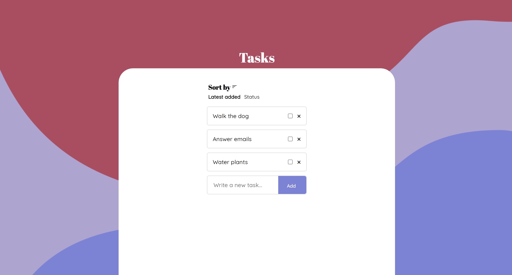

# To do list ✓
A basic to do list I created while learning JavaScript

## Installation
Clone the repo\
git clone https://github.com/johannafryxell/ToDoList

## Built with
- HTML & SASS
- JavaScript
- Gulp

## Details
This was a personal project I created in school based on an assignment.

You can create a task, mark it as done, as well as remove it completely.

The list is saved in localStorage.
